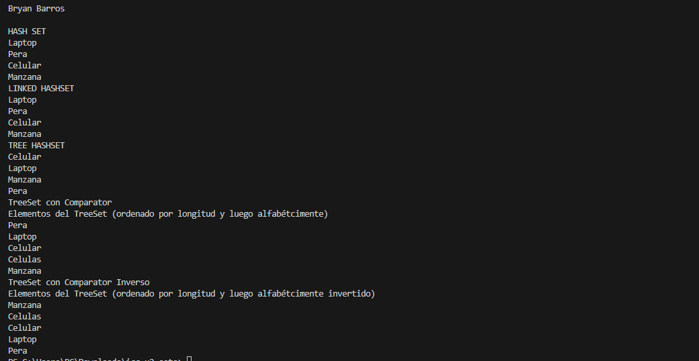
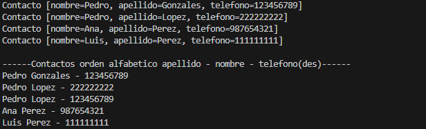

# Práctica Sets

## 📌 Información General

- **Título:** Sets
- **Asignatura:** Estructura de Datos
- **Carrera:** Computación
- **Estudiante:** Bryan Barros
- **Fecha:** 01/07/2025
- **Profesor:** Ing. Pablo Torres

---
## 🎯 Objetivos
Comprender y comparar distintos metodos Sets, demostrando el uso de cada uno ya sea HashSet, LinkedHashSet y TreeSet.

URL del Repositorio:https://github.com/Bryan-BarrosV/icc-u2-sets.git

---
## 🗂️ Estructura del Proyecto

- **controllers:** Contiene las clases que gestionan la lógica principal y la interacción con los conjuntos (`Sets`) y los contactos (`ContactoController`).
- **models:** Incluye las clases que representan los datos, como la clase `Contacto` que modela la información de una persona.
- **utils:** Alberga los comparadores personalizados (`Comparator`) utilizados para definir diferentes criterios de ordenamiento en los conjuntos, como `ContactoComparator` y `ContactoComparadorConNumero`.

Estas divisiones permiten mantener el código organizado y facilitan la reutilización y el mantenimiento.

## 💡 Características

- HashSet: Demuestra la naturaleza desordenada y sin duplicados de HashSet.
- LinkedHashSet: Muestra cómo LinkedHashSet mantiene el orden de inserción mientras asegura la unicidad.
- TreeSet: Explora el ordenamiento natural de TreeSet y cómo se pueden usar comparadores personalizados.
- Comparadores Personalizados: Ejemplos de TreeSet ordenado por longitud de cadena y luego alfabéticamente, tanto en orden ascendente como descendente.
---

## 🚀 Ejecución

---

---

